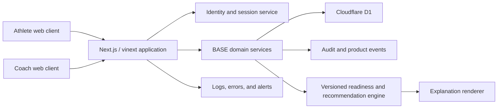

# BASE Technical Design Document (TDD)

## Document record

| Field | Value |
|---|---|
| Version | 0.1 |
| Status | Draft |
| Technical owner | Pending |
| Product stage | Prototype → pilot MVP |
| Last reviewed | 2026-08-03 |

## 1. Purpose

This document defines how BASE should evolve from the current interactive prototype into a secure, observable, pilot-ready product. It turns the PRD into an implementable architecture while preserving the Founder's Blueprint: coach authority, explainability, safety, data minimization, and reversible decisions.

The TDD describes the target direction and staged migration. It does not claim that all target components already exist.

## 2. Current system

The repository currently uses:

- Next.js 16.2 and React 19.2 with TypeScript;
- vinext/Vite for Cloudflare-compatible build and runtime;
- a mobile-first client flow in `app/page.tsx`;
- Tailwind CSS 4 plus project CSS;
- Drizzle ORM 0.45 with Cloudflare D1/SQLite;
- a Cloudflare Worker entry point and image optimization;
- one persisted `feedback_responses` table;
- a `POST /api/feedback` route with validation and a honeypot;
- Node test assertions plus build and lint scripts;
- Sites/Cloudflare hosting configuration.

The current training plan, readiness values, recommendations, and set logs are hard-coded or stored in browser state. There is no production identity, authorization, coach workflow, domain model, audit log, or operational analytics.

## 3. Design goals

1. Preserve a simple athlete interaction while increasing system rigor.
2. Make authorization and data ownership explicit.
3. Make recommendation inputs, rules, versions, and decisions auditable.
4. Keep the architecture small enough for an early-stage team.
5. Support safe schema evolution and testable domain logic.
6. Separate deterministic policy from AI-generated language or suggestions.
7. Avoid infrastructure that is not justified by pilot load or reliability needs.

## 4. Architecture principles

- **Modular monolith first.** Keep one deployable application while enforcing domain boundaries in code.
- **Server authority.** The server owns permissions, published plans, recommendation records, and confirmed logs.
- **Deterministic core.** Readiness classification and material adjustment rules use versioned deterministic logic until evidence justifies more complexity.
- **Append important history.** Consequential changes preserve before/after values and actors.
- **Thin clients.** Client state improves interaction but does not become the canonical record.
- **Deny by default.** Every record access is authenticated and relationship-scoped.
- **Operational simplicity.** Prefer managed Cloudflare capabilities already aligned with the repository.

## 5. Target logical architecture




AI services, wearable ingestion, object storage, and asynchronous job processing are optional later components. They must not be introduced into the critical path until their use case and fallback are defined.

## 6. Code organization

Recommended structure:

```text
app/
  (athlete)/
  (coach)/
  api/
components/
domains/
  identity/
  relationships/
  exercises/
  programming/
  sessions/
  readiness/
  recommendations/
  feedback/
lib/
  auth/
  db/
  validation/
  observability/
db/
  schema/
  migrations/
tests/
  unit/
  integration/
  contract/
  e2e/
```

Domain modules own their validation, service functions, policy checks, and tests. Route handlers translate HTTP input to domain commands and must not contain material business rules.

## 7. Domain model

### Identity and relationships

- `users`: identity provider subject, status, locale, timezone, created/updated timestamps.
- `athlete_profiles`: user reference, units, optional sport profile fields.
- `coach_profiles`: user reference and professional metadata approved for collection.
- `coach_athlete_relationships`: coach, athlete, status, permissions, invitation and revocation timestamps.
- `consents`: user, policy type, policy version, granted/revoked timestamps.

### Exercise and programming

- `exercises`: stable slug, name, category, movement family, equipment, status.
- `exercise_localizations`: exercise, locale, display name, cues.
- `program_templates`: owner, name, description, status, version.
- `planned_sessions`: athlete, coach/creator, local date, timezone, status, purpose, published version.
- `planned_exercises`: session, exercise, order, notes, technical focus.
- `planned_sets`: exercise instance, order, target reps, target load, intensity/RPE/RIR, rest, tempo.

### Execution

- `training_sessions`: planned session reference, athlete, started/completed timestamps, status.
- `performed_sets`: session, planned set reference, load, reps, RPE, result status, timestamps.
- `session_outcomes`: session-level difficulty, notes, completion reason, optional structured feedback.

### Readiness and recommendations

- `readiness_checkins`: athlete, session, structured inputs, band, score where applicable, policy version, timestamp.
- `recommendations`: check-in/session, type, original value, proposed value, rationale codes, policy/model version, confidence/uncertainty, status.
- `recommendation_decisions`: recommendation, actor, accept/reject/modify, resulting value, reason, timestamp.
- `coach_adjustment_policies`: athlete relationship, allowed adjustment types and bounds, version.

### Governance

- `audit_events`: actor, action, entity type/id, before/after payload reference, request correlation, timestamp.
- `product_events`: pseudonymous actor, event name/version, entity references, minimal properties.
- `feedback_responses`: preserve existing pilot feedback model, with a future normalized export path.

## 8. Data conventions

- IDs use a globally unique format that does not expose table counts.
- All timestamps are stored in UTC; the user's IANA timezone is stored separately.
- Loads are stored in a canonical unit with explicit display conversion.
- Structured inputs use typed columns where queried; flexible JSON is reserved for versioned payloads and snapshots.
- Rows include `created_at` and `updated_at`; mutable business objects include a version or optimistic concurrency token.
- Soft deletion is used only when recovery or legal/audit needs justify it. Otherwise use explicit deletion with appropriate audit metadata.

## 9. Authentication and authorization

Authentication must use a supported external identity provider or a well-maintained framework; BASE must not implement password cryptography itself.

Authorization is enforced server-side for every command and query:

- athletes may read and update their own permitted records;
- coaches may access an athlete only through an active relationship and granted permission;
- unpublished coach drafts are not visible to athletes;
- administrative access is separate, least-privileged, and audited;
- analytics and support tools use pseudonymous or minimized data where possible.

UI visibility is not authorization.

## 10. API design

Use route handlers with JSON request/response contracts and shared runtime validation. Resource-oriented examples:

```text
GET    /api/v1/me
GET    /api/v1/athlete/today
POST   /api/v1/readiness-checkins
POST   /api/v1/recommendations/:id/decisions
POST   /api/v1/training-sessions
POST   /api/v1/training-sessions/:id/sets
PATCH  /api/v1/performed-sets/:id
POST   /api/v1/training-sessions/:id/complete
GET    /api/v1/coach/athletes
POST   /api/v1/planned-sessions
POST   /api/v1/planned-sessions/:id/publish
```

Contracts must include stable error codes, user-safe messages, request correlation IDs, and idempotency keys for retry-prone writes such as set logging and session completion.

## 11. Readiness engine

The readiness engine is a pure, versioned domain function:

```ts
type ReadinessInput = {
  energy: 1 | 2 | 3 | 4 | 5;
  sleepQuality: 1 | 2 | 3 | 4 | 5;
  soreness: 1 | 2 | 3 | 4 | 5;
  pain: boolean;
  athleteBaseline?: ReadinessBaseline;
  coachPolicy: AdjustmentPolicy;
};

type ReadinessResult = {
  band: "green" | "amber" | "red" | "human-review";
  rationaleCodes: string[];
  proposedActions: ProposedAction[];
  policyVersion: string;
};
```

Rules:

- Pain routes to `human-review`; it does not calculate an injury or prescribe treatment.
- Inputs are validated and missing data is explicit.
- Adjustment bounds come from an approved policy, not client code.
- Output uses rationale codes rendered into localized explanations.
- The full input snapshot, policy version, result, and decision are persisted.
- Rule changes require fixtures, domain review, and an ADR when material.

## 12. AI boundary

AI is not required for pilot MVP readiness scoring. If introduced, AI must sit outside the deterministic safety boundary.

Permitted initial uses include summarization, draft explanations, coach-reviewed program suggestions, and natural-language navigation. Each use requires:

- defined input and output schema;
- offline evaluation set and pass criteria;
- prompt/model versioning;
- timeout and non-AI fallback;
- sensitive-data review;
- prohibited-output handling;
- audit record for training-relevant output.

AI text may explain an approved structured result; it must not silently change that result.

## 13. Persistence and consistency

D1 remains appropriate for the pilot if observed write patterns and latency fit. Transactions should keep session, recommendation decision, and audit writes consistent where supported.

Set logging must support retry without duplicates. Optimistic UI may be used, but the client must display pending, saved, and failed states. Confirmed data is only data acknowledged by the server.

Schema migrations are append-only artifacts in source control. Destructive migrations require backup, verification, staged rollout, and rollback/recovery instructions.

## 14. Offline and unreliable networks

The pilot should tolerate temporary connection loss during a session:

- retain unsent set logs locally with generated idempotency keys;
- show unsynced state clearly;
- retry on reconnection;
- resolve conflicts using server version plus user-visible review;
- never report completion until the server confirms it.

Full offline programming is not an MVP requirement.

## 15. Security and privacy controls

- Secure, HTTP-only session cookies with appropriate same-site and expiry policy.
- CSRF protection where the auth architecture requires it.
- Runtime validation and bounded payload sizes on all writes.
- Rate limits for authentication, invitations, feedback, and high-volume writes.
- Content security policy and secure response headers.
- Secrets stored in managed environment bindings, never the repository.
- Dependency and secret scanning in CI.
- Audit logging for relationship, permission, plan publication, and recommendation actions.
- Documented export, deletion, retention, backup, and incident-response procedures.

Free text must be treated as potentially sensitive and must not be placed in logs or analytics.

## 16. Observability

Minimum operational signals:

- structured application errors with correlation IDs;
- request rate, latency, and error rate by route;
- authentication and authorization failures;
- D1 query and migration failures;
- set-log save failures and retry backlog;
- readiness/recommendation engine errors;
- deployment health and synthetic core-flow check;
- privacy, safety, and data-integrity incident channel.

Alerts must map to an owner and response action. Avoid alerts that do not require action.

## 17. Testing strategy

### Unit tests

- readiness policy tables and edge cases;
- permissions and relationship policies;
- training volume and plan/completion comparisons;
- validation and localization mappings.

### Integration tests

- API + D1 persistence;
- authentication and authorization boundaries;
- idempotent set logging;
- recommendation decision and audit history;
- migrations against representative data.

### End-to-end tests

- athlete onboarding and today's session;
- readiness, recommendation, override, and completion;
- coach creates, publishes, and reviews a session;
- relationship revocation;
- failed-network set recovery.

### Quality gates

Every PR must pass formatting/lint, type checking, unit/integration tests, build, migration validation when relevant, and security checks proportional to the change.

## 18. Deployment and environments

Use separate development, preview, staging, and production environments with isolated data. Pull requests receive preview deployments where feasible. Production deployment requires successful checks, migration plan, and rollback/recovery readiness.

Feature flags should protect incomplete or risky features. Flags need owners and removal dates.

## 19. Delivery sequence

1. Extract prototype logic into typed domain modules and add unit tests.
2. Add identity, users, and coach-athlete relationships.
3. Create exercise, plan, session, and set schemas plus migrations.
4. Persist athlete session execution with idempotent writes.
5. Implement versioned readiness and recommendation records.
6. Add coach programming and review workflows.
7. Add audit events, product analytics, and operational monitoring.
8. Validate backup, recovery, deletion, and access revocation.
9. Run a staged pilot and use evidence to revise architecture.

## 20. Architecture decision records

An ADR is required for material choices including authentication provider, ID format, D1 suitability beyond pilot, event/analytics platform, AI provider and data handling, offline conflict policy, multi-coach permissions, and introduction of asynchronous processing.

Each ADR records context, options, decision, consequences, owner, and review trigger.

## 21. Risks

| Risk | Technical response |
|---|---|
| Business rules remain in UI state | Extract pure versioned domain services |
| Authorization leaks athlete data | Relationship-scoped policy tests and deny-by-default queries |
| Duplicate logs on retry | Idempotency keys and unique constraints |
| Recommendation cannot be reproduced | Persist inputs, policy version, output, and decision |
| D1 limits appear during growth | Measure load, define migration triggers, avoid provider-specific domain coupling |
| AI creates unsafe variance | Keep AI outside deterministic safety boundary and require fallback |
| Schema evolves during pilot | Versioned migrations, backups, representative migration tests |

## 22. Open technical decisions

- Identity provider and account-recovery approach.
- Stable ID format.
- Exact D1 transaction and backup strategy.
- Analytics platform and data residency.
- Initial offline queue implementation.
- Multi-coach permission model.
- Audit payload retention and encryption approach.
- Conditions that trigger migration from D1.

## 23. Acceptance criteria

The TDD is ready for approval when the PRD's MVP requirements map to components and data, authorization is testable, readiness decisions are reproducible, failure and recovery behavior is explicit, migrations and observability have owners, and all unresolved architectural choices are recorded rather than hidden.

## 24. Approval record

| Role | Approver | Decision | Date |
|---|---|---|---|
| Founder / product owner | Pending | Pending | Pending |
| Technical owner | Pending | Pending | Pending |
| Security/privacy reviewer | Pending | Pending | Pending |

## 25. Change log

| Version | Date | Status | Summary |
|---|---|---|---|
| 0.1 | 2026-08-03 | Draft | Initial target design for the BASE pilot MVP. |
